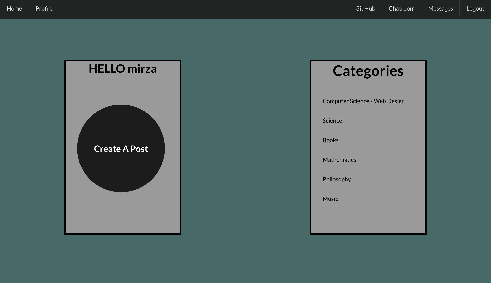
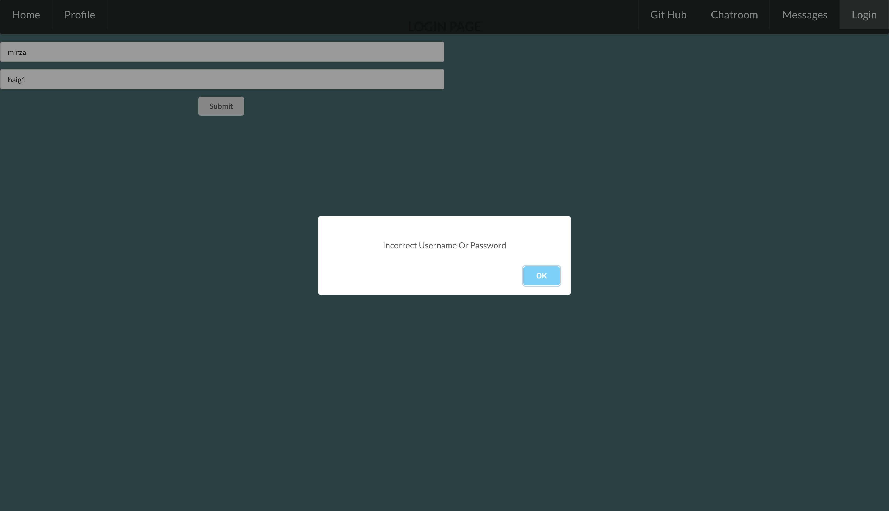
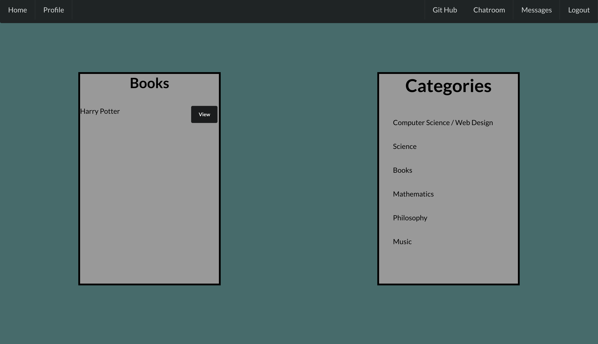
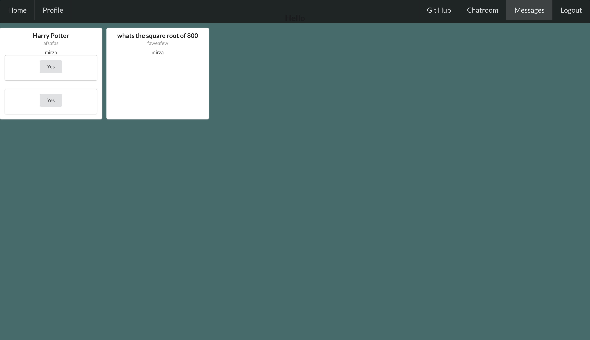
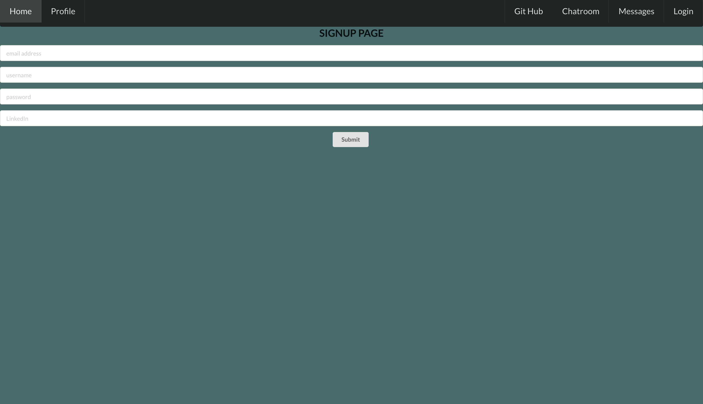
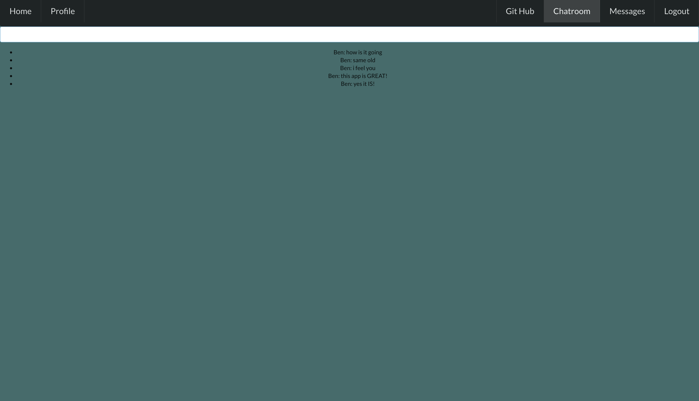

## Available Scripts
In the project directory, you can run:

### 1- `npm install`
### 2- `npm start`
Runs the app in the development mode. 
Open [http://localhost:3000](http://localhost:3000) to view it in the browser.
# Chat App
Peer to peer chat application.

## Link to Original(older) Repo
https://github.com/mmirzabaig/chat-app-react

## Languages Used
- HTML
- CSS
- JavaScript
- JSX
- Mongoose

## APIs Used:

### Front-End
- React
- Scoket.io-client

### Back-End
- Node
- Express
- Socket.io
- MongoDB

## Stretch Goals:

## Images:

